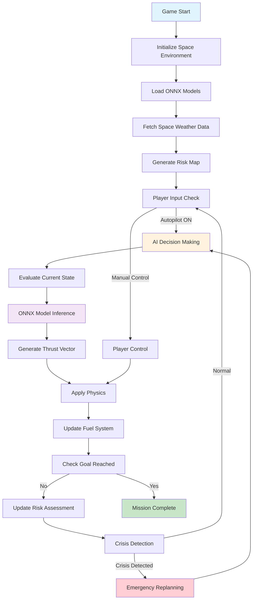
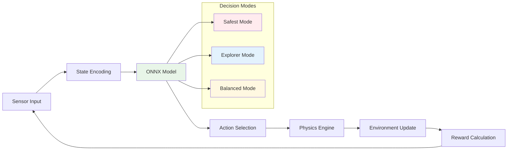

# AEGIS


##  Overview

AEGIS is an innovative Unity-based space game that demonstrates advanced artificial intelligence through reinforcement learning. The project features autonomous spacecraft navigation using ONNX models derived from custom-trained RL algorithms, showcasing real-time space weather data integration, dynamic pathfinding, and intelligent decision-making systems.

### Key Features

- **AI-Powered Spacecraft Navigation**: Autonomous autopilot system with ONNX model integration
- **Real-time Space Weather Integration**: Live solar wind and magnetic field data from NOAA/SWPC
- **Dynamic Risk Assessment**: Real-time hazard evaluation and adaptive pathfinding
- **3D Space Environment**: Immersive planetary systems with Mars, Earth, and Saturn
- **Advanced Pathfinding**: A* algorithm with multiple navigation modes (Safest, Explorer, Balanced)
- **Fuel Management System**: Realistic resource constraints and consumption
- **Interactive UI**: Toggle-based autopilot control with visual feedback

## Project Architecture

### Core Components

```
AEGIS/
├── Assets/
│   ├── _project/
│   │   ├── Scripts/
│   │   │   ├── Autopilot/          # AI navigation system
│   │   │   ├── ShipSystems/        # Ship mechanics
│   │   │   └── UI/                 # User interface
│   │   ├── Scenes/Main.unity       # Primary game scene
│   │   └── Materials/              # Visual assets
│   ├── ONNX model/                 # AI model files
│   │   ├── odin_game_agent.onnx    # Standard navigation model
│   │   └── odin_game_agent_aggressive.onnx  # Aggressive mode model
│   └── Plugins/                    # External dependencies
├── AEGIS.ipynb                     # RL training notebook
└── README.md                       # This file
```

##  AI System Details

### Reinforcement Learning Architecture

The AEGIS AI system is built around the **ODIN (Orbital Dynamics Intelligence Network)** framework, which combines:

1. **Environment Modeling**: 3D space environment with dynamic obstacles and hazards
2. **State Representation**: 37-dimensional observation space including:
   - Agent position and velocity (6D)
   - Fuel/Delta-v budget (1D)  
   - Goal direction vector (3D)
   - Local risk sensor grid (27D - 3x3x3 cube)

3. **Action Space**: Continuous 3D thrust vector control
4. **Reward Function**: Multi-objective optimization balancing:
   - Goal proximity
   - Fuel efficiency
   - Risk avoidance
   - Dynamic fuel-based risk tolerance

### Training Pipeline

The RL models are trained using **PPO (Proximal Policy Optimization)** with curriculum learning:

```python
# Curriculum Stages
1. Easy Mode: No obstacles, basic navigation
2. Medium Mode: Static obstacles, moderate complexity  
3. Hard Mode: Dynamic obstacles, crisis scenarios
```
### Model Architecture 


### ONNX Model Integration

- **Framework**: TensorFlow/Keras → ONNX export
- **Runtime**: Unity Barracuda (inference engine)
- **Model Types**: 
  - Standard Agent: Balanced risk/efficiency
  - Aggressive Agent: High-risk, high-reward navigation

## Space Weather Integration

### Real-time Data Sources

The system integrates live space weather data from NOAA Space Weather Prediction Center:

- **Solar Wind Plasma**: Speed, density, temperature
- **Magnetic Fields**: Bx, By, Bz components  
- **Proton Flux**: High-energy particle measurements
- **X-ray Data**: Solar flare monitoring

### Risk Assessment Algorithm

```python
# Dynamic Risk Calculation
risk_score = (0.4 * proton_flux + 
              0.3 * bz_risk + 
              0.3 * plasma_density)

# Fuel-based risk tolerance
fuel_factor = 1.0 + (current_fuel / max_fuel)
risk_penalty = fuel_factor * risk_score * penalty_weight
```

##  Demo

 [Download AEGIS Demo Video](Demo/Aegis_Demo.mp4) — MP4 (136 MB, stored with Git LFS)

*Click to download or view the full demo video.*

### Quick Start Guide

1. **Prerequisites**:
   - Unity 2022.3 or later
   - Windows/Mac/Linux support
   - ~2GB free space

2. **Installation**:
   ```bash
   git clone <repository-url>
   cd Aegis
   # Open in Unity Hub
   ```

3. **Controls**:
   - **A Key**: Toggle Autopilot
   - **Mouse**: Camera control
   - **WASD**: Manual ship control (when autopilot disabled)

### Gameplay Demo Scenarios

#### Scenario 1: Basic Mars Navigation
- **Objective**: Navigate from Earth orbit to Mars
- **Features**: Basic autopilot, fuel management
- **Expected Duration**: 2-3 minutes

#### Scenario 2: Crisis Response
- **Objective**: Navigate during solar storm
- **Features**: Dynamic replanning, risk avoidance
- **Expected Duration**: 3-5 minutes

#### Scenario 3: Fuel-Critical Mission
- **Objective**: Reach destination with minimal fuel
- **Features**: Aggressive mode, efficiency optimization
- **Expected Duration**: 4-6 minutes

### Visual Features

- **Real-time Risk Visualization**: Color-coded threat levels
- **Trajectory Planning**: Visual path prediction
- **Fuel Gauge**: Real-time consumption tracking
- **Space Weather HUD**: Live data feeds
- **Planet Rendering**: High-quality celestial bodies

## System Flowchart



### AI Decision Flow



##  Technical Implementation

### Key Scripts

#### AutopilotController.cs
- **Purpose**: Main AI navigation controller
- **Features**: 
  - ONNX model integration
  - Fuel consumption management
  - Input system override
  - Mars approach automation

#### AutopilotUI.cs
- **Purpose**: User interface for autopilot control
- **Features**:
  - Toggle functionality
  - Visual state feedback
  - Keyboard shortcuts

#### PlanetVisibilityController.cs
- **Purpose**: Optimized planetary rendering
- **Features**:
  - Distance-based LOD
  - Billboard fallback system
  - Performance optimization

### Unity Packages Used

- **AI Navigation**: com.unity.ai.navigation (1.1.5)
- **Cinemachine**: com.unity.cinemachine (2.10.4)
- **Input System**: com.unity.inputsystem (1.7.0)
- **TextMeshPro**: com.unity.textmeshpro (3.0.6)
- **XR Support**: com.unity.xr.openxr (1.11.0)

### Performance Considerations

- **ONNX Model Size**: ~2-5MB per model
- **Inference Time**: <1ms per decision
- **Memory Usage**: ~100-200MB runtime
- **Target FPS**: 60+ on mid-range hardware

##  Future Enhancements

### Planned Features
- [ ] Multi-agent swarm intelligence
- [ ] Procedural mission generation
- [ ] VR/AR support integration
- [ ] Multiplayer competitive modes
- [ ] Advanced physics simulation
- [ ] Real-time model training

### Research Applications
- **Space Mission Planning**: NASA/ESA collaboration potential
- **Autonomous Navigation**: Satellite constellation management
- **Risk Assessment**: Space weather impact modeling
- **AI Safety**: Robust decision-making in uncertain environments

## Dependencies & Requirements

### Unity Requirements
- Unity 2022.3 LTS or later
- Universal Render Pipeline (URP)
- Input System package
- AI Navigation package

### Development Environment
- **Training**: Python 3.8+, TensorFlow 2.x, Stable-Baselines3
- **Data Sources**: NOAA/SWPC APIs
- **Build Targets**: Windows, macOS, Linux

### External APIs
- NOAA Space Weather Prediction Center
- GOES Satellite Data
- DSCOVR Solar Wind Data

## Achievements & Milestones

-  Successful RL model training and ONNX conversion
-  Real-time space weather data integration
-  Unity Barracuda ONNX inference implementation
-  Dynamic risk assessment and pathfinding
-  Crisis scenario handling and replanning
-  Multi-mode AI behavior (Safest/Explorer/Balanced)

## Contributors

This project was developed by a dedicated team of 4 developers:

<table>
<tr>
    <td align="center">
        
        <br />
        <sub><b>Abijith Raja</b></sub>
        <br />
        <a href="https://github.com/abijithraja" title="GitHub">@abijithraja</a>
        <br />
        <i>Project Lead & Unity Developer</i>
    </td>
    <td align="center">
        
        <br />
        <sub><b>Mithielesh</b></sub>
        <br />
        <a href="https://github.com/mithielesh" title="GitHub">@mithielesh</a>
        <br />
        <i>Project Lead & AI Engineer</i>
    </td>
    <td align="center">
        
        <br />
        <sub><b>Vardhann</b></sub>
        <br />
        <a href="https://github.com/vardhann27" title="GitHub">@vardhann27</a>
        <br />
        <i>Designer & Systems Engineer</i>
    </td>
    <td align="center">
        
        <br />
        <sub><b>Gokul Prashanth</b></sub>
        <br />
        <a href="https://github.com/oosoowhat-png" title="GitHub">@oosoowhat-png</a>
        <br />
        <i>Designer & Systems Engineer</i>
    </td>
</tr>
</table>

### Team Contributions
- **Abijith Raja**: Unity implementation, autopilot system, UI/UX design,Game mechanics, scene design, visual effects, testing, deployment;.
- **Mithielesh**: RL model development, ONNX integration, space weather data pipeline.
- **Vardhann**: Visual effects ,Performance optimization,3D modeling.
- **Gokul Prashanth**: Performance optimization,3D modeling.


*AEGIS represents the cutting edge of AI-powered game development, combining real-world space data with advanced machine learning to create an immersive and educational gaming experience.*
